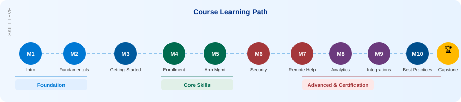

# Microsoft Intune Training Course - Complete Lab Guide

  

## 📋 Course Overview

This comprehensive Microsoft Intune training course provides hands-on labs and practical experience with Microsoft Endpoint Manager. From fundamentals to advanced scenarios, this course prepares you for real-world Intune deployments and certifications like MD-102 and MS-101.

## 🗺️ Learning Path

  

## 🏗️ Intune Ecosystem Architecture

  

## 🎯 What You'll Learn

- Device enrollment and management across all platforms
- Application deployment and protection
- Security and compliance implementation
- Integration with Azure AD, Microsoft 365, and Defender
- Automation with PowerShell and Graph API
- Best practices for enterprise deployments

## 📚 Course Structure

### [Module 1 - Introduction](./Module-01-Introduction)
- Overview of Microsoft Intune
- Understanding Modern Device Management
- **Labs:**
  - Lab 1.1: Explore Microsoft Endpoint Manager Admin Center
  - Lab 1.2: Review Intune Use Case Scenarios

### [Module 2 - Intune Fundamentals](./Module-02-Intune-Fundamentals)
- Intune vs Configuration Manager vs Microsoft Endpoint Manager
- Core Components and Subscriptions
- **Labs:**
  - Lab 2.1: Compare Intune and Configuration Manager
  - Lab 2.2: Review Licensing Requirements

### [Module 3 - Getting Started](./Module-03-Getting-Started)
- Setting Up Your Environment
- Azure AD Integration
- Basic Device Enrollment
- **Labs:**
  - Lab 3.1: Create Microsoft 365 Trial Tenant
  - Lab 3.2: Add Users and Groups in Azure AD
  - Lab 3.3: Connect Azure AD with Intune
  - Lab 3.4: Enroll Your First Test Device

### [Module 4 - Device Enrollment & Management](./Module-04-Device-Enrollment-Management)
- Multi-platform Device Enrollment
- Configuration Profiles
- Compliance Policies
- Windows Update Management
- **Labs:**
  - Lab 4.1: Enroll Windows 10/11 Device
  - Lab 4.2: Enroll Android Device (Work Profile/Fully Managed)
  - Lab 4.3: Enroll iOS/iPadOS Device
  - Lab 4.4: Create WiFi Configuration Profile
  - Lab 4.5: Create Device Compliance Policy
  - Lab 4.6: Configure Windows Update for Business

### [Module 5 - Application Management](./Module-05-Application-Management)
- Application Deployment Strategies
- Win32 Apps, Store Apps, and Web Links
- App Protection Policies (MAM)
- **Labs:**
  - Lab 5.1: Deploy Microsoft Store Application
  - Lab 5.2: Upload and Deploy Win32 App
  - Lab 5.3: Deploy Web Link Application
  - Lab 5.4: Create App Protection Policy
  - Lab 5.5: Configure App Configuration Policy

### [Module 6 - Security & Compliance](./Module-06-Security-Compliance)
- Conditional Access Implementation
- Endpoint Security Features
- Integration with Microsoft Defender
- **Labs:**
  - Lab 6.1: Create Conditional Access Policy
  - Lab 6.2: Create Compliance Policy
  - Lab 6.3: Enable BitLocker on Windows Devices
  - Lab 6.4: Configure Firewall Rules
  - Lab 6.5: Integrate Microsoft Defender for Endpoint
  - Lab 6.6: Apply Endpoint Security Baseline

### [Module 7 - Remote Help & Support](./Module-07-Remote-Help-Support)
- Remote Help Configuration
- Roles and Permissions
- Troubleshooting Managed Devices
- **Labs:**
  - Lab 7.1: Install and Enable Remote Help
  - Lab 7.2: Configure Roles and Permissions
  - Lab 7.3: Perform Remote Assistance Session
  - Lab 7.4: Troubleshoot Enrollment Issues

### [Module 8 - Reporting & Analytics](./Module-08-Reporting-Analytics)
- Intune Reporting
- Endpoint Analytics
- Compliance Monitoring
- **Labs:**
  - Lab 8.1: Review Device Compliance Reports
  - Lab 8.2: Enable Endpoint Analytics
  - Lab 8.3: Create Custom Report with Log Analytics
  - Lab 8.4: Monitor Application Installation Status

### [Module 9 - Integrations & Advanced Scenarios](./Module-09-Integrations-Automation)
- Windows Autopilot
- Microsoft Purview Integration
- PowerShell and Graph API Automation
- **Labs:**
  - Lab 9.1: Configure Windows Autopilot Profile
  - Lab 9.2: Integrate with Microsoft Purview
  - Lab 9.3: Use PowerShell for Intune Management
  - Lab 9.4: Use Microsoft Graph API
  - Lab 9.5: Automation Script for Device Enrollment

### [Module 10 - Best Practices & Real-World Scenarios](./Module-10-Best-Practices)
- Policy Organization
- Application Deployment Strategies
- Common Mistakes and How to Avoid Them
- **Labs:**
  - Lab 10.1: Design Effective Group Structure
  - Lab 10.2: Build Phased Deployment Strategy
  - Lab 10.3: Troubleshoot Application Installation Failure
  - Lab 10.4: Review and Audit Security Policies

### [Module 11 - Capstone Project & Certification](./Module-11-Capstone)
- Complete Lab Build
- Comprehensive Practical Project
- Certification Preparation
- **Labs:**
  - Lab 11.1: Comprehensive Enterprise Deployment Project
  - Lab 11.2: Simulate MD-102/MS-101 Exam Questions
  - Lab 11.3: Hands-on Review of Key Scenarios

## 🚀 Getting Started

### Prerequisites
- Microsoft 365 trial tenant (free)
- Azure AD basic understanding
- Access to Windows 10/11, iOS, or Android test devices
- Basic PowerShell knowledge (for advanced modules)

## 🛠️ Lab Environment Requirements

### Recommended Setup
- **Test Devices:**
  - 1x Windows 10/11 VM or physical device
  - 1x Android device (or emulator)
  - 1x iOS device (optional)
  
- **Software:**
  - Microsoft 365 Trial Subscription
  - Azure AD Premium P1 (trial)
  - PowerShell 7.x
  - Visual Studio Code (for scripts)

### Cloud Resources
- Microsoft Endpoint Manager Admin Center
- Azure Portal access
- Microsoft Graph Explorer

## 📄 License & Copyright

This course is protected under the **Creative Commons Attribution-NonCommercial-NoDerivatives 4.0 International** license.

> ⚠️ **You may NOT copy, redistribute, sell, or create derivative works from this content.**  
> Personal study and classroom reference are permitted. See [LICENSE](LICENSE) for full terms.

© 2026 [emadadel2008](https://github.com/emadadel2008) — All Rights Reserved.

## 🙏 Acknowledgments

- Microsoft Learn documentation
- Intune community contributors
- Course participants and testers

## 🔗 Additional Resources

- [Microsoft Intune Documentation](https://docs.microsoft.com/en-us/mem/intune/)
- [Microsoft Endpoint Manager Blog](https://techcommunity.microsoft.com/t5/microsoft-endpoint-manager-blog/bg-p/MicrosoftEndpointManagerBlog)
- [Graph API Documentation](https://docs.microsoft.com/en-us/graph/)
- [PowerShell for Intune](https://docs.microsoft.com/en-us/powershell/module/microsoft.graph.intune/)

## 📊 Course Statistics

- **Total Modules**: 11
- **Total Labs**: 45+
- **Estimated Duration**: 40-50 hours
- **Difficulty Level**: Beginner to Advanced

---

**Last Updated**: January 2026  
**Course Version**: 2.0  
**Maintained By**: [Your Name/Organization]

⭐ If you find this course helpful, please star this repository!
