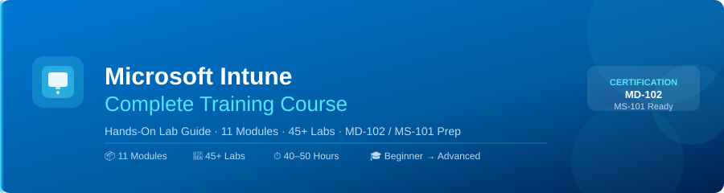
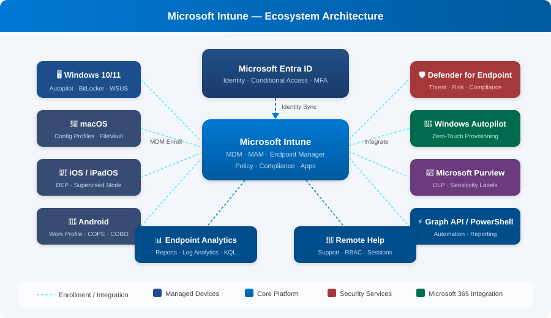

# Microsoft Intune Training Course

  

## 📋 Course Overview

This comprehensive Microsoft Intune training course provides hands-on labs and practical experience with Microsoft Endpoint Manager. From fundamentals to advanced scenarios, this course prepares you for real-world Intune deployments and certifications like **MD-102** and **MS-101**.

## 🗺️ Learning Path

  

## 🏗️ Intune Ecosystem Architecture

  

## 🎯 What You'll Learn

- Device enrollment and management across all platforms
- Application deployment and protection
- Security and compliance implementation
- Integration with Azure AD, Microsoft 365, and Defender
- Automation with PowerShell and Graph API
- Best practices for enterprise deployments

## 📚 Course Structure

| Module | Topic | Labs |
|--------|-------|------|
| [Module 1](modules/01-introduction/index.md) | Introduction to Microsoft Intune | 2 |
| [Module 2](modules/02-intune-fundamentals/index.md) | Intune Fundamentals | 2 |
| [Module 3](modules/03-getting-started/index.md) | Getting Started | 4 |
| [Module 4](modules/04-enrollment-management/index.md) | Device Enrollment & Management | 6 |
| [Module 5](modules/05-application-management/index.md) | Application Management | 5 |
| [Module 6](modules/06-security-compliance/index.md) | Security & Compliance | 6 |
| [Module 7](modules/07-remote-help-support/index.md) | Remote Help & Support | 4 |
| [Module 8](modules/08-reporting-analytics/index.md) | Reporting & Analytics | 4 |
| [Module 9](modules/09-integrations-automation/index.md) | Integrations & Automation | 5 |
| [Module 10](modules/10-best-practices/index.md) | Best Practices | 4 |
| [Module 11](modules/11-capstone/index.md) | Capstone Project & Certification | 3 |

## 🚀 Getting Started

### Prerequisites

- Microsoft 365 trial tenant (free)
- Azure AD basic understanding
- Access to Windows 10/11, iOS, or Android test devices
- Basic PowerShell knowledge (for advanced modules)

## 🛠️ Lab Environment Requirements

### Recommended Setup

**Test Devices:**

- 1× Windows 10/11 VM or physical device
- 1× Android device (or emulator)
- 1× iOS device (optional)

**Software:**

- Microsoft 365 Trial Subscription
- Azure AD Premium P1 (trial)
- PowerShell 7.x
- Visual Studio Code (for scripts)

### Cloud Resources

- Microsoft Endpoint Manager Admin Center
- Azure Portal access
- Microsoft Graph Explorer

## 📊 Course Statistics

| Stat | Value |
|------|-------|
| Total Modules | 11 |
| Total Labs | 45+ |
| Estimated Duration | 40–50 hours |
| Difficulty Level | Beginner to Advanced |

## 🔗 Additional Resources

- [Microsoft Intune Documentation](https://docs.microsoft.com/en-us/mem/intune/)
- [Microsoft Endpoint Manager Blog](https://techcommunity.microsoft.com/t5/microsoft-endpoint-manager-blog/bg-p/MicrosoftEndpointManagerBlog)
- [Graph API Documentation](https://docs.microsoft.com/en-us/graph/)
- [PowerShell for Intune](https://docs.microsoft.com/en-us/powershell/module/microsoft.graph.intune/)

---

## 📄 License & Copyright

This course is protected under the **Creative Commons Attribution-NonCommercial-NoDerivatives 4.0 International** license.

> ⚠️ **You may NOT copy, redistribute, sell, or create derivative works from this content.**
> Personal study and classroom reference are permitted.

© 2026 [emadadel2008](https://github.com/emadadel2008) — All Rights Reserved.
